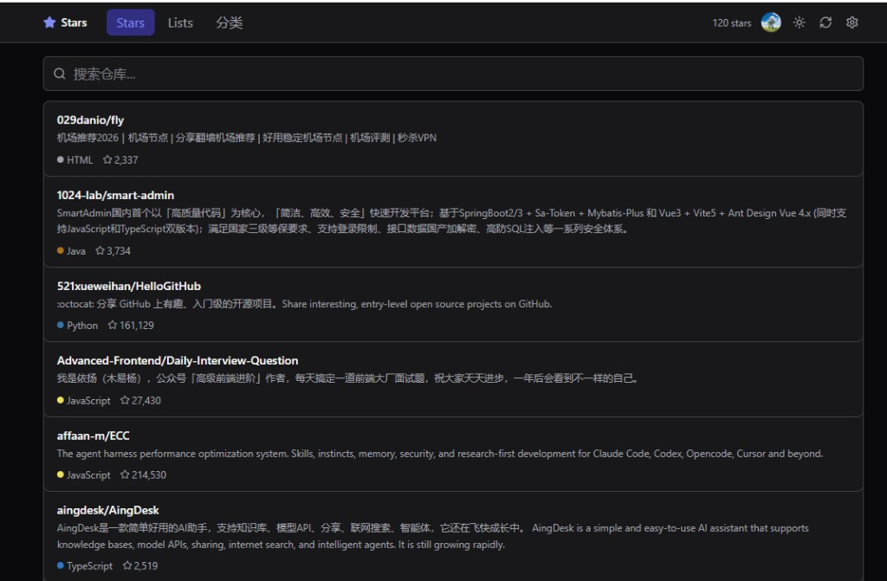
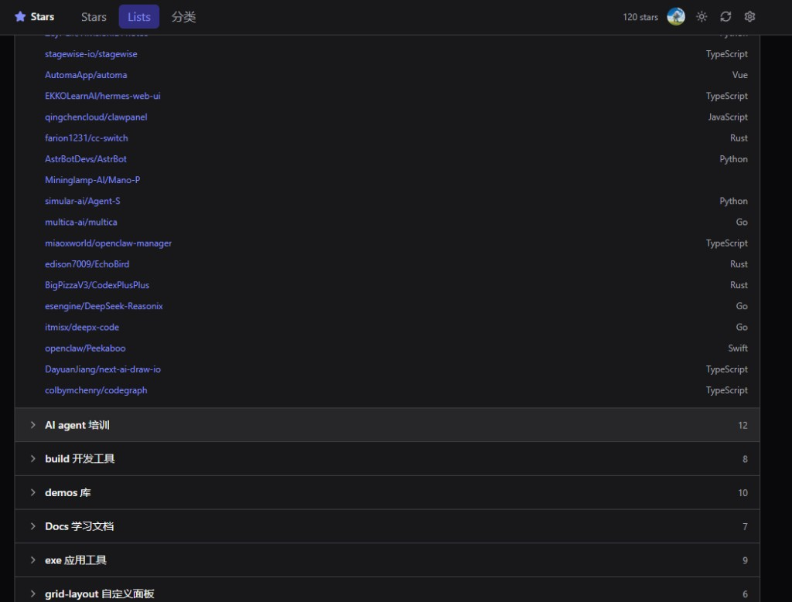
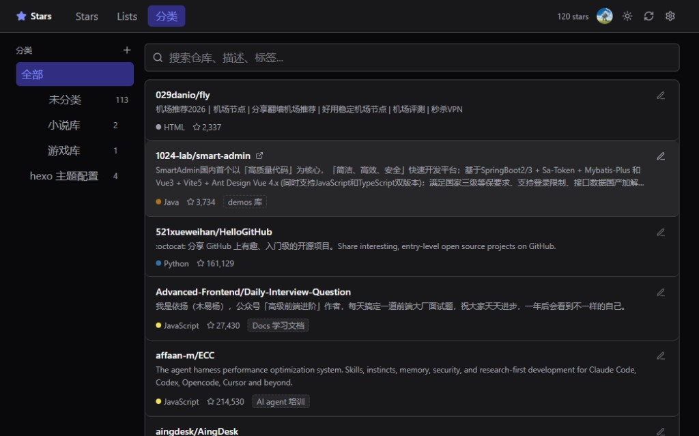

# Stars Manager

精简版 GitHub Stars 管理工具，以 **Chrome / Edge 浏览器扩展** 为主。

## 界面预览

### GitHub Stars

浏览并搜索已星标的仓库。



### GitHub Star Lists

查看 GitHub 官方 Star Lists（只读）。



### 我的分类

本地 DIY 分类、描述与 Tag，与 GitHub Lists 完全独立。



---

## 功能

| 功能 | 说明 |
|------|------|
| **GitHub Stars** | 同步并浏览星标仓库 |
| **GitHub Star Lists** | GitHub 官方列表（只读） |
| **我的分类** | 本地 DIY 分类、描述、Tag，与 GitHub Lists 独立 |
| **深色 / 浅色主题** | 自动记忆偏好 |
| **数据备份** | 导出 / 导入 `stars-data.yaml` |

---

## 快速开始

### 安装扩展（Chrome / Edge）

```bash
npm install
npm run build:extension
```

加载步骤：

1. 打开 `chrome://extensions` 或 `edge://extensions`
2. 开启「开发者模式」
3. 「加载已解压的扩展程序」→ 选择 `extension/dist`
4. 点击扩展图标 → 新标签页打开完整界面

### 开发（watch 模式）

```bash
npm install
npm run dev
```

修改代码后会自动重新构建 `extension/dist`，在扩展管理页点击刷新即可。

如需单独调试共用 UI，可运行 `npm run dev:client` 在浏览器中预览界面（数据仍走扩展存储逻辑时需加载扩展）。

---

## 使用步骤

1. **设置** → 填入 GitHub Token
2. 点击 **同步**，拉取 Stars 和 Star Lists
3. 在 **分类** Tab 管理 DIY 分类、描述、Tag

Token 创建：https://github.com/settings/tokens （需 `read:user`）

---

## 数据存储（YAML）

所有 DIY 数据以 YAML 保存在 `chrome.storage.local`（非磁盘文件）。Stars 列表本身可从 GitHub 重新拉取，只需备份 DIY 部分。

| 内容 | 说明 |
|------|------|
| `stars-data.yaml` | DIY 分类、描述、Tag，扩展内导出备份用 |
| `data/demo-data.yaml` | 仓库示例文件，格式相同，可提交 GitHub |
| GitHub 缓存 | 扩展内缓存，可重新同步 |
| GitHub Token | 存在扩展本地，勿分享 |

### 备份与恢复

设置中 **导出** `stars-data.yaml` 可备份分类数据；**导入** 可恢复或迁移到另一台设备的扩展。

仓库里的 `data/demo-data.yaml` 是同款格式的示例文件，可直接提交到 GitHub。多设备同步时仍用导出/导入 `stars-data.yaml`（修改后导出 → 提交或拷贝 → 另一台设备导入）。

---

## 常用命令

| 命令 | 说明 |
|------|------|
| `npm run dev` | 扩展 watch 构建 |
| `npm run build` | 构建扩展（同 `build:extension`） |
| `npm run build:extension` | 构建浏览器扩展 |
| `npm run verify:extension` | 检查扩展配置无本地服务残留 |

---

## 项目结构

```
packages/
  shared/          # 类型、GitHub API
  core/            # YAML 业务逻辑（分类、缓存、Token）
client/            # React UI（扩展共用）
extension/         # Chrome / Edge 扩展（Manifest V3）
server/            # 历史 Web 后端（扩展不依赖，可忽略）
```

---

## 技术栈

React 19 · Vite · Tailwind CSS 4 · Zustand · YAML · Chrome Extension MV3
